# Mock Make

Mock Make, a full-stack application inspired by Etsy, is an e-commerce platform where users can buy and sell a wide range of unique products and items.

## Database Schema Design
![db-schema]

[db-schema]: ./react-vite/images/db-schema.png

## Get Started

## Authors
 * Teagan Stutsman
   * https://github.com/TStutsman
 * Nur Unlu
   * https://github.com/NurCodeWiz
 * Finn Beilke
   * https://github.com/fbeilke


**Prerequisites**
- NPM
- A version of Node.js >= 14 on your local machine
- Python 3.9
- PostgreSQL
- An AWS S3 bucket

**Installation**
- Clone the repo
- Install dependencies ``` pipenv install --dev -r dev-requirements.txt && pipenv install -r requirements.txt```
- `cd react-app` and run `npm install`
- Create a **.env** file based on the example with proper settings for your development environment
- Setup a PostgreSQL database, user, and password and make sure they match your **.env** file.
- Get into your pipenv, migrate your database, seed your database, and run your app

   ```bash
   pipenv shell
   ```

   ```bash
   flask db upgrade
   ```

   ```bash
   flask seed all
   ```

   ```bash
   flask run

- Create your AWS user and bucket:
    - Create a bucket: (https://s3.console.aws.amazon.com/s3/home?region=us-east-1)
    - Navigate to ( https://console.aws.amazon.com/iam/home?#/users) to create a user with `Programmatic access`.
    - Set up a security policy for your user: 'Attach existing policies directly' => 'Create Policy'
    - Click the `JSON` tab and set a policy.
- Now update your **.env** with your `S3_BUCKET`, `S3_KEY`, `S3_SECRET`
- Fire up your servers: `flask run` in root and `npm start` in `react-app`

## Technologies
- JavaScript
- React
- Redux
- PostgreSQL
- Python
- AWS SDK

## Features
1. **Authentication**
   - New account creation, log in, and log out functionalities.
   - Guest/demo login option for trying out the site.
   - Users must be logged in to access orders, wish lists, or create reviews.
2. **Products**
   - CRUD operations for product listings.
   - Users can create new product listings.
   - Users can view existing listings.
   - Creators can update or delete their own product listings.
3. **Cart**
   - CRUD operations for the shopping cart.
   - Users can create a new order.
   - Users can view the items in their order.
   - Users can update or delete items in their order.
4. **Reviews**
   - CRD operations for product reviews.
   - Users can create new reviews on items.
   - All users can read existing reviews on items.
   - Review creators can delete their own reviews.
5. **Orders**
   - CRD operations for orders.
   - Users can see open and past orders.
   - Users can submit their current cart as an order.
   - Users can cancel open orders.
6. **Wish List**
   - CRD operations for wish lists.
   - Users can create a wish list of items.
   - Users can view items on their wish list.
   - Users can delete items from their wish list.
7. **Search**
   - Users can search for products based on names or categories.
   - Advanced search filters available for refining search results.

## Authentication
Mock Make provides a user-friendly authentication system allowing users to sign up for new accounts, log in, log out, and use a guest/demo login option for exploring the site without creating an account. Access to certain features such as orders, wish lists, and creating reviews is restricted to logged-in users.

## Products
Users can browse through a wide range of products listed on Mock Make. Logged-in users can create new product listings, update their own listings, and delete them if needed. Any user can view existing product listings to discover unique items available on the platform.

## Cart
The shopping cart feature allows users to add products they wish to purchase. Logged-in users can create new orders from their cart, view the items in their order, update quantities or remove items, and proceed to checkout. This feature provides a seamless shopping experience for users.

## Reviews
Users can share their experiences by writing reviews for products they have purchased. All users can read existing reviews to make informed decisions when browsing products. Review creators have the ability to delete their own reviews if needed, maintaining control over their feedback.

## Orders
Mock Make keeps track of users' orders, allowing them to view both open and past orders. Logged-in users can submit their current cart as an order, review order details, and cancel open orders if necessary. This feature streamlines the order management process for users.

## Wish List
Users can create wish lists of their favorite items on Mock Make. This feature enables users to keep track of products they are interested in purchasing in the future. Users can easily view and manage items on their wish list, removing items as needed.

## Search
Mock Make offers a robust search functionality, allowing users to find products based on keywords, categories, or specific criteria. Advanced search filters are available to refine search results, making it easier for users to discover relevant products quickly.

# Features

## Landing Page
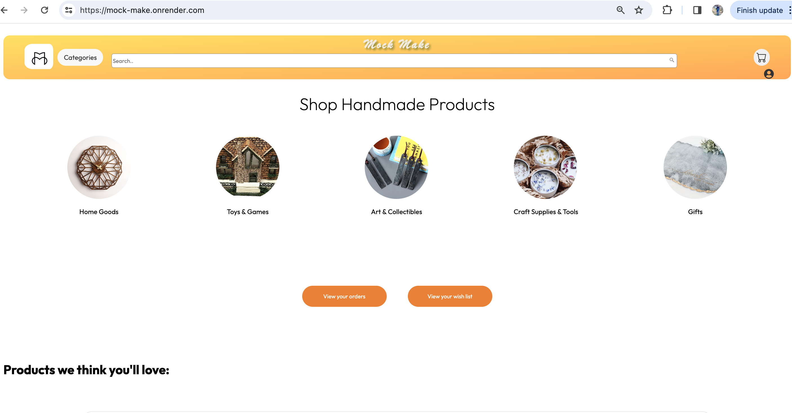
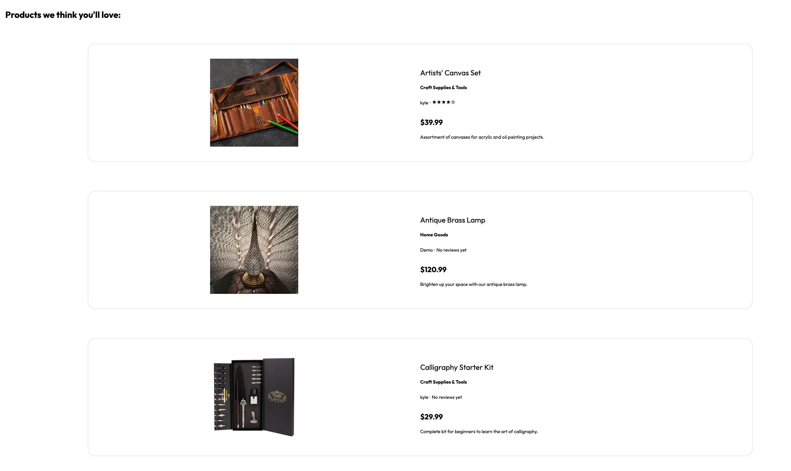
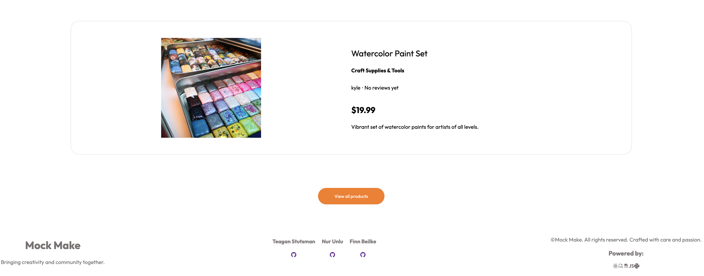

## User Auth Sign in and Sign Up

Users can log into an existing account or sign up and create a new account. Users can also test the site with the Demo Login feature.

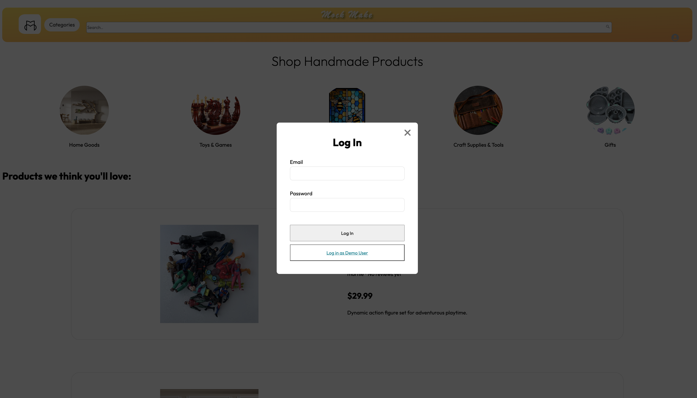
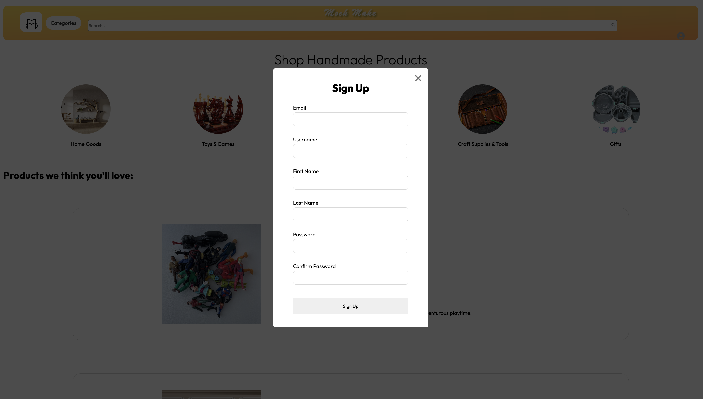

## Users can add a product listing via a form.

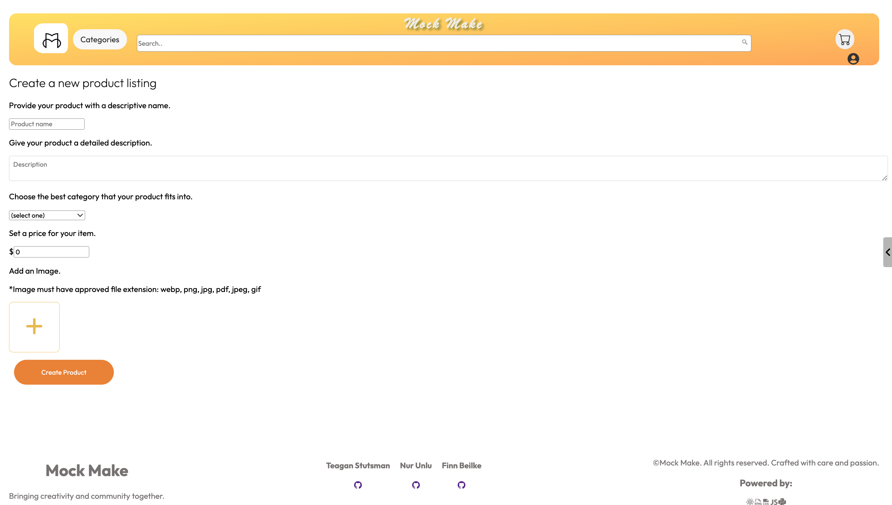

## Users can view all listing products.


## Users can view all listing products base on categories  and add to Cart.

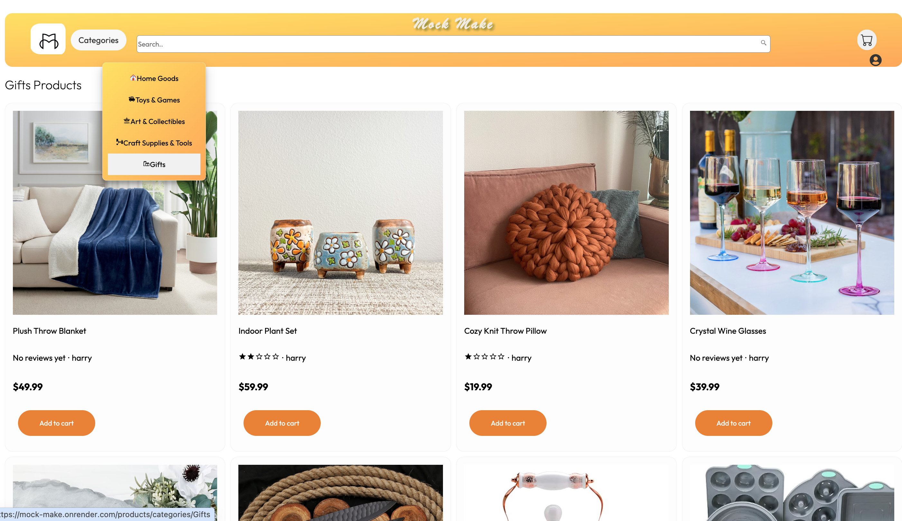

## Users can view product's details can add to cart and wish list and create a review.

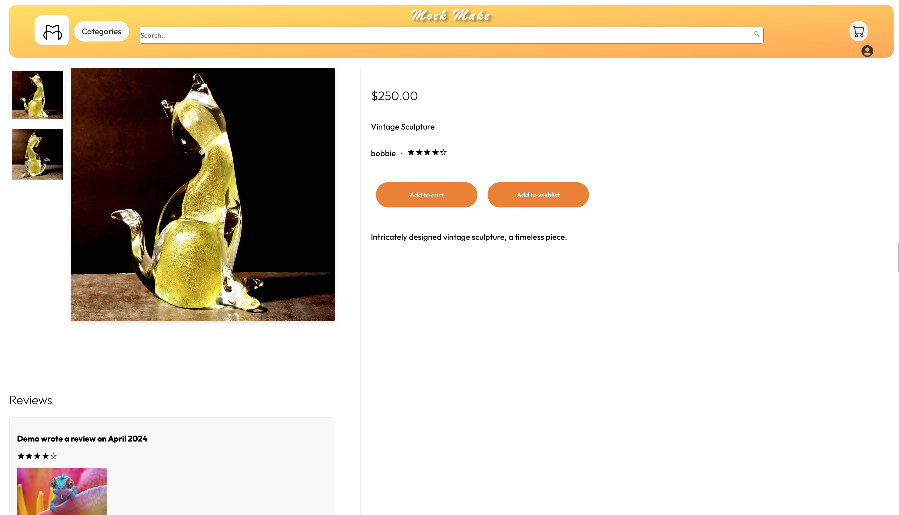

## Users can update and delete their own listings.

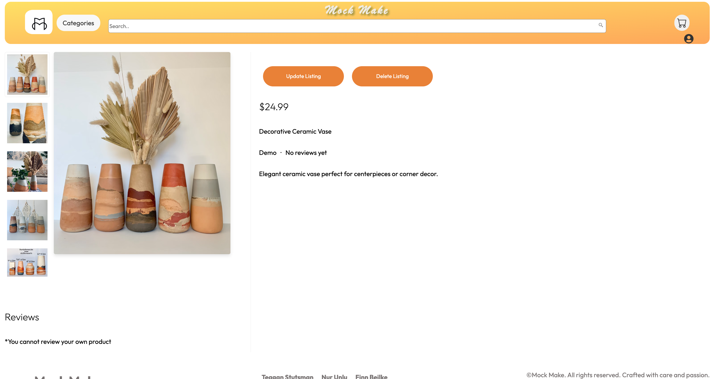

## Users can update their listings using the update form.

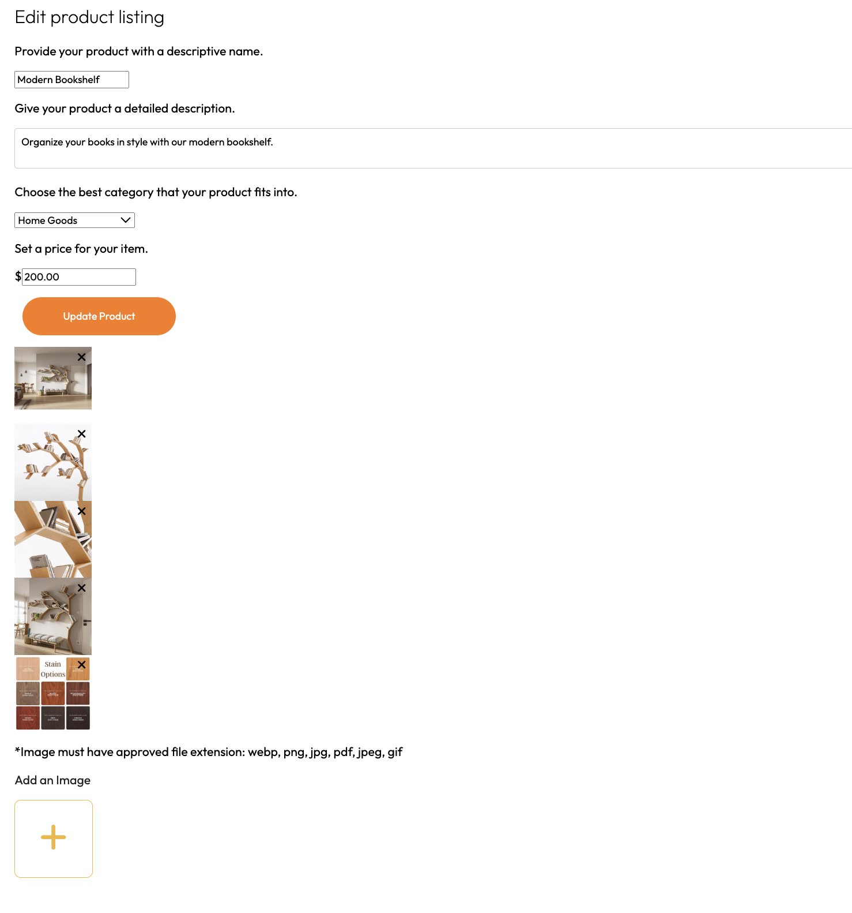

## Shopping Cart

Users can add products by clicking on add to cart and view, update, delete items and check out in the shopping cart via the sidebar. The sidebar can be opened by clicking on the cart button in the navigation or by clicking the 'add to cart' button.

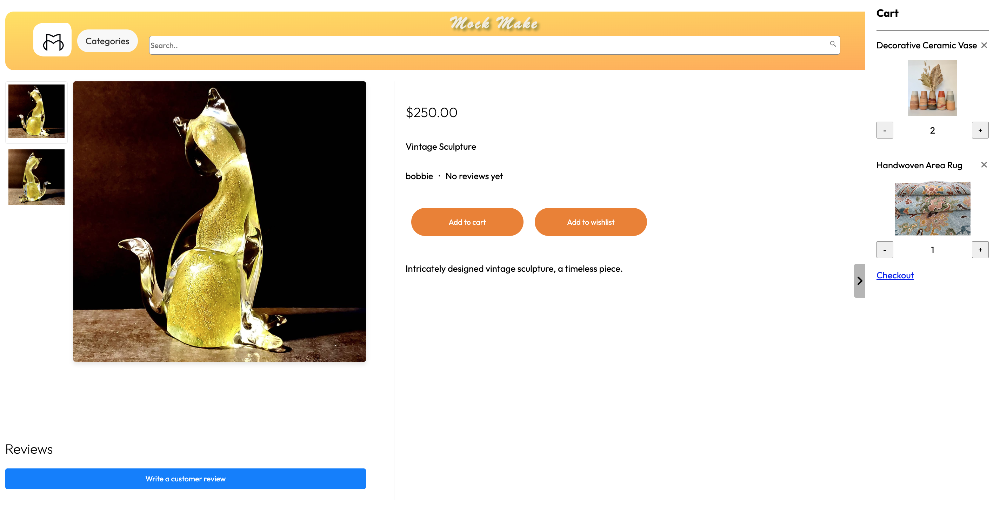

## Orders

Users can checkout on the cart and create an order, then delete any pending orders.

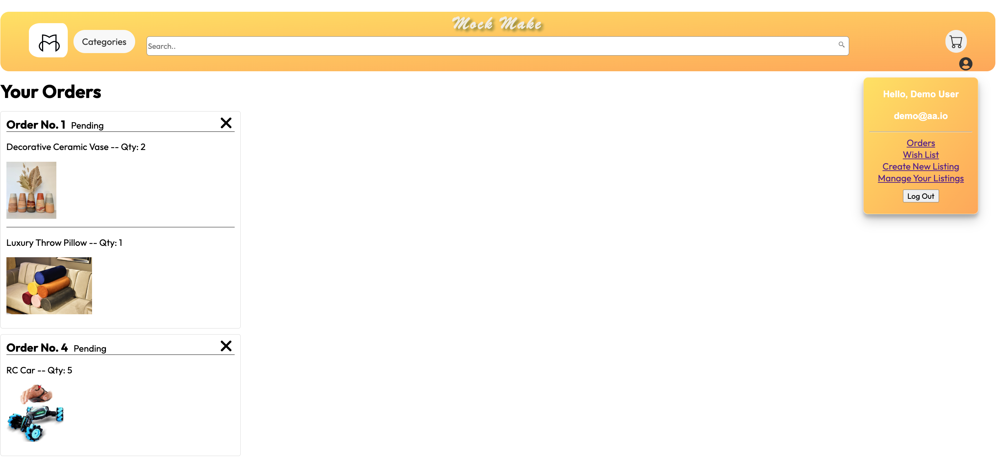

## Reviews


Logged-in users can add, view, and delete reviews. They can also add an image to their review.

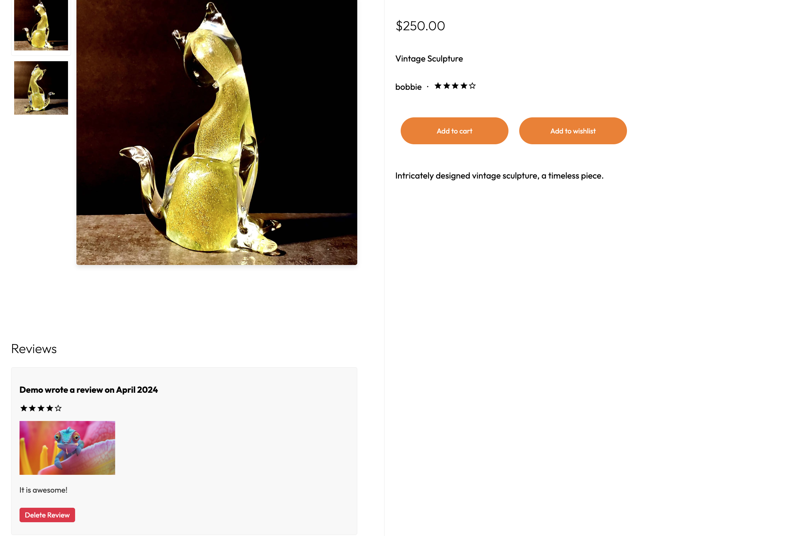
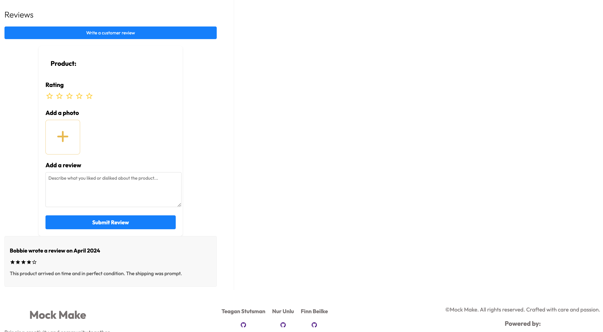

## Wish Lists

Users can add products to their wish lists, and view and delete their wish lists. They can also add products from their wish lists to their shopping carts.

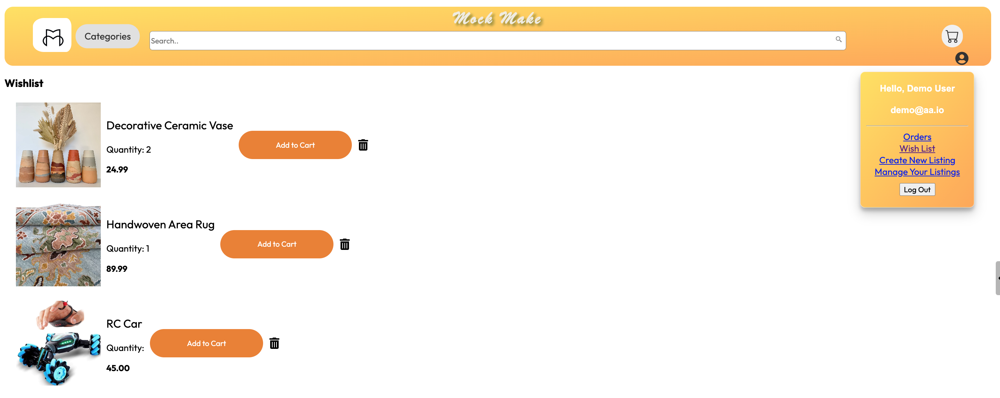

## Search

Users can search for products name using the Search feature.

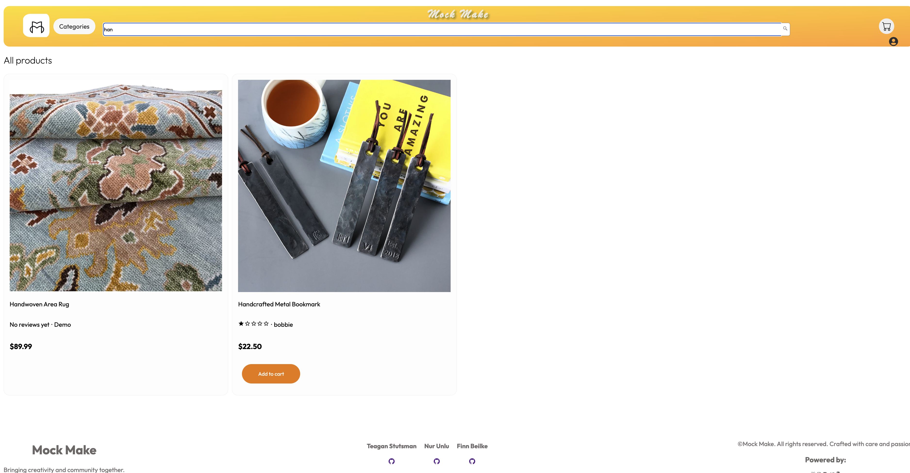


# Stack
 * React: https://react.dev/
 * Redux: https://redux.js.org/
 * Flask: https://flask.palletsprojects.com/en/2.3.x/
 * WTForms: https://wtforms.readthedocs.io/en/3.0.x/
 * SQAlchemy: https://www.sqlalchemy.org/
