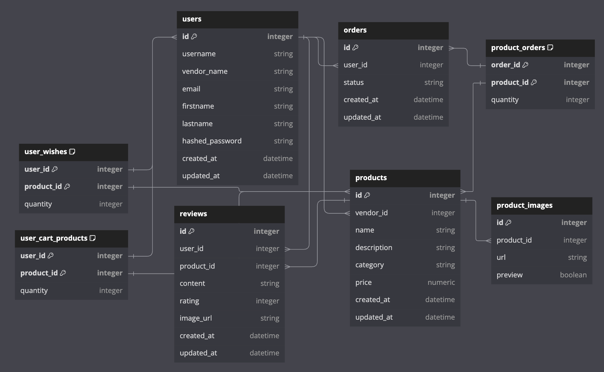

# **Database Schema**

## `users`

| column name     | data type | details                   |
|-----------------|-----------|---------------------------|
| id              | integer   | not null, primary key     |
| username        | string    | not null                  |
| email           | string    | not null, indexed, unique |
| hashed_password | string    | not null                  |
| created_at      | datetime  | not null                  |
| updated-at      | datetime  | not null                  |

## `user_wishes`
| column name   | data type | details               |
|---------------|-----------|-----------------------|
| user_id       | integer   | not null, primary key |
| product_id    | integer   | not null, primary key |

* `user_id` references `users` table
* `product_id` references `products` table

## `products`

| column name | data type | details               |
|-------------|-----------|-----------------------|
| id          | integer   | not null, primary key |
| vendor_id   | integer   | not null, foreign key |
| name        | string    | not null              |
| description | string    | not null              |
| price       | numeric   | not null              |
| created_at  | datetime  | not null              |
| updated_at  | datetime  | not null              |

* `vendor_id` references `users` table

## `product_orders`

| column name | data type | details               |
|-------------|-----------|-----------------------|
| product_id  | integer   | not null, primary key |
| order_id    | integer   | not null, primary key |
| quantity    | integer   | not null              |e

* `order_id` references `orders` table
* `product_id` references `products` table

## `orders`

| column name | data type | details               |
|-------------|-----------|-----------------------|
| id          | integer   | not null, primary key |
| user_id     | integer   | not null, foreign key |
| status      | string    | not null              |
| created_at  | datetime  | not null              |
| updated_at  | datetime  | not null              |

* `user_id` references `users` table

## `reviews`

| column name   | data type | details               |
|---------------|-----------|-----------------------|
| id            | integer   | not null, primary key |
| user_id       | integer   | not null, foreign key |
| product_id    | integer   | not null, foreign key |
| content       | string    | not null              |
| rating        | integer   | not null              |
| created_at    | datetime  | not null              |
| updated_at    | datetime  | not null              |

* `user_id` references `users` table
* `product_id` references `products` table

## `product_images`

| column name   | data type | details                        |
|---------------|-----------|--------------------------------|
| id            | integer   | not null, primary key          |
| product_id    | integer   | indexed, foreign key           |
| url           | string    | not null                       |
| preview       | boolean   | not null                       |

* `product_id` references `products` table
